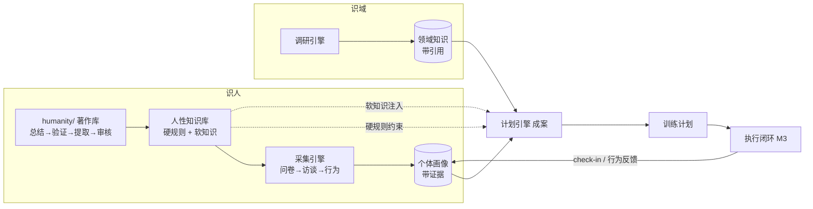

# MonkeyHandler

> 先懂人类，再懂领域，然后给出这个人真正练得下去的训练计划。

AI 驱动的**个体化学习/训练工作台**开源框架（Python）。

市面上的训练计划普遍有两个盲区：**不懂人**——模板化计划无视个体的作息、精力曲线、动机类型与伤病史；**不懂领域**——计划背后的「为什么」不可见，常常偏离该领域真正有效的方法。结果大多数人中途放弃。MonkeyHandler 把解决方案拆成三个引擎 + 一个闭环，并把「对人本身的深刻理解」做成一等公民。

（English TL;DR: MonkeyHandler is a Python framework for building human-friendly, individualized training workbenches. It pairs a book-derived model of human nature — universal mechanisms plus individual-difference dimensions — with an evidence-based user profile, pluggable cited domain research, and motivation-aware plan generation with an execution feedback loop.）

## 三大能力 + 一个闭环

| 能力 | 一句话 | 核心模块 |
| --- | --- | --- |
| **识人** | 先持有对人类的系统性理解（共性机制 + 个体差异维度），再以有效方法论采集「这一个人」的关键属性，形成带证据的画像 | `humanity/`、`core/humanity.py`、`core/profiling.py`、`core/user_model.py` |
| **识域** | 领域可插拔：对任意专业做带引用的调研，产出技能图、训练方法、失败模式 | `core/research.py`、`core/domain.py` |
| **成案** | 受三方约束（画像 / 领域知识 / 人性规律）生成可解释、可持续、让人痴迷的计划 | `core/plan.py`、`core/motivation.py` |
| **执行闭环**（M3） | check-in → 依从性追踪 → 再校准 | 见 [路线图](docs/roadmap.md) |

## 识人是两层结构（本项目最重要的设计决定）

理解「这一个人」之前，系统必须先理解「人类」本身——且要明确区分**共性**（对所有人成立的机制：需求结构、习惯回路、现时偏差、恢复规律……）与**个体差异维度**（人在哪些维度上彼此不同、为什么影响训练、**如何测量**）。

为此我们设立 `humanity/` 著作库：搜集最具影响力且公认言之有物的人类著作（心理学、认知学、成功学、社会学、脑科学，以及《沉思录》《传习录》等古典经典），每本走同一条流水线：

```
选书 → 总结核心思想 → 逐主张交叉验证（争议不入库）→ 提取面向训练设计的
提示词与方法论 → 【用户审核，入库硬门槛】→ 综合（synthesis/）
```

详见 [humanity/README.md](humanity/README.md)。



## 设计原则（硬约束）

1. **画像事实必须带证据**——不允许「凭空出现」的结论；
2. **领域知识必须带引用**——不可追溯的结论不进计划；
3. **最小提问原则**——每个采集问题必须声明它将改变的计划决策，答了不会改变任何决策的问题不存在；
4. **人性知识分级使用**——安全/恢复类编译为可测试的硬规则（如恢复预算约束强度上限）；动机/偏好类作为生成时的软上下文；
5. **争议主张不入库**——著作提取经过逐主张验证，站不住脚的主张只留在存疑区（指证据争议：被推翻、复制失败、修辞层面）；
6. **计划必须可解释**——每份计划附 rationale，说明它依据哪些画像事实、领域方法与人性机制；
7. **审核门唯一**——提取与设计**不做事前伦理排除**；一切机制与提示词的去留由用户审核逐案决定。可持续性（长期依从）是设计分析的目标变量，不是事前禁令；
8. **本地优先**——画像与执行数据属于敏感数据，默认不出本机，LLM 调用只传最小必要摘要。

## 快速开始

```bash
git clone <repo-url>
cd MonkeyHandler
pip install -e ".[dev]"

monkeyhandler demo   # 离线演示：内置画像 → 健身领域包 → 生成 4 周计划（无需 LLM）
pytest               # 测试（守护上述设计原则）
```

## 首批著作库

共 36 本（选书标准与流水线见 [humanity/README.md](humanity/README.md)）：

- **心理学**：《思考，快与慢》《心流》《终身成长》《驱动力》
- **认知学**：《认知天性》《刻意练习》
- **成功学/行为改变**：《掌控习惯》《坚毅》《习惯的力量》《人性的弱点》
- **社会学**：《影响力》《乌合之众》《社会心理学》（Myers）
- **脑科学/哲学·人性经典**：《我们为什么要睡觉》《运动改造大脑》《君主论》《鬼谷子》《沉思录》《传习录》
- **产品设计相邻学科**（17 本）：游戏设计（《Rules of Play》《全景探秘游戏设计艺术》《游戏感》）、人机交互（《日常的设计》《Designing Interactions》）、学习科学（《人是如何学习的 II》《追求理解的教学设计》）、动机心理学（SDT 两部）、行为科学/选择架构（《助推》《"错误"的行为》）、叙事与视听（《理解漫画》《Hamlet on the Holodeck》《Game Sound》《Auditory Display》）、服务与系统（《这才是服务设计》《系统之美》）

当前进度：**36 本全部走完流水线**（总结 → 逐主张验证 → 提取），状态**待用户审核**；synthesis/ 内已产出反向推导的草稿（影响因素网 → 逐层推导 → 工作流 → Prompt 库），同样待审核。

## 路线图

M0 骨架（当前）→ M1 最小闭环 → M2 调研引擎 + LLM 访谈 → M3 执行闭环与动机层 → M4 可插拔性验证 → 详见 [docs/roadmap.md](docs/roadmap.md)。

## 状态与贡献

M0 骨架阶段，接口会变。欢迎通过 issue 讨论设计与领域包。

License: [MIT](LICENSE)
