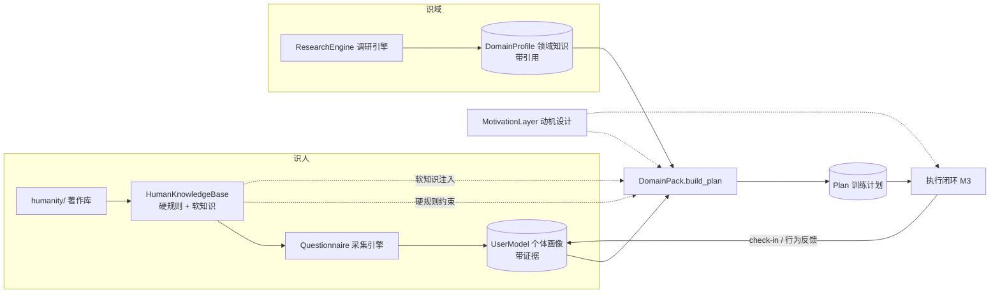

# 架构设计

## 1. 定位与边界

MonkeyHandler 是一个**框架/库**，不是成品应用：它定义「个体化学习/训练工作台」的核心引擎与协议。任何人实现一个 `DomainPack`（领域包）即可把自己的专业领域接入系统；产品化的界面（Web/CLI/桌面）建立在框架之上。

## 2. 总览



计划生成同时受**三方约束**：

1. **个体画像**——这一个人（带证据）；
2. **领域知识**——这个专业（带引用）；
3. **人性知识库**——人的一般规律（硬规则强制执行，软知识注入生成上下文）。

## 3. 识人：两层结构

### 3.1 第一层：人类通识知识库（humanity/ + core/humanity.py）

**定位**：指导「如何设计有效的、辅助用户学习训练的方案」这一实践，而非百科式知识堆砌。

**内容策略（已确认：混合）**——著作库走生产流水线，运行时承载其审核产物：

| 流水线步骤 | 产出 | 存放 |
| --- | --- | --- |
| ① 选书 | 最具影响力、公认言之有物的著作（心理学/认知学/成功学/社会学/脑科学/古典哲学·人性经典） | `humanity/works/<book>/work.md` |
| ② 总结 | 核心思想 | `summary.md` |
| ③ 验证 | **逐主张**交叉验证 2-3 个独立来源，标注「支持 / 有争议 / 被推翻」；**争议主张不入库**，只留在存疑区 | `verification.md` |
| ④ 提取 | 面向核心目标（理解人类 → 理解用户 → 让用户痴迷训练）的提示词与方法论 | `prompts.md` |
| ⑤ 审核 | **用户审核是入库硬门槛** | 状态流转 |
| ⑥ 综合 | 综合成的提示词库、方法论、工作流 | `humanity/synthesis/` |

哲学/古典类著作（《沉思录》《传习录》《君主论》《鬼谷子》）的验证标准与实证类不同：验证「思想影响力 + 内部自洽 + 与目标的相关性」，提取时聚焦可操作维度（如知行合一、斯多葛控制二分法、说服框架）。

**运行时索引层**（`KnowledgeEntry`）：

- `kind=UNIVERSAL` 共性条目 / `kind=DIFFERENCE` 个体差异维度条目；
- 内核纪律（由代码强制）：差异维度必须给出 `measure`（测量方法）；所有条目必须附 `sources`（可追溯到著作库或文献）；
- **分级使用**：`is_hard_rule=True` 的安全/恢复类条目编译为可执行规则（如 `recovery_budget`——睡眠/压力决定强度上限，任何一次训练不得超过）；动机/偏好类作为软上下文经 `summary()` 注入 LLM。

### 3.2 第二层：采集引擎（core/profiling.py）

方法论约束：

- **关键属性的确定权**：通用核心集由人性知识库的差异维度条目**派生**（`core_questions`，派生关系显式校验），领域包只补充领域专属问题——通用画像能力可沉淀复用；
- **最小提问原则**：每个 `Question` 必须声明 `decision_point`（它将改变的计划决策），由模型校验强制；未回答的问题跳过，不臆造；
- **证据链**：每个答案以 `Evidence(SELF_REPORT)` 入画像，画像断言接口 `assert_fact` 拒绝无证据写入；
- **升级路线**：M0-M1 结构化问卷 → M2 LLM 自适应访谈（追问/澄清/按需探查）→ M3 起以行为数据交叉验证自报偏差（三角验证）。

### 3.3 第三层：个体画像（core/user_model.py）

- 四维度组织：认知 / 心理 / 生理 / 偏好约束；
- 每条事实 = 值 + 证据链（来源/详情/置信度/时间）+ 可选的知识库条目关联（`based_on`）；
- 画像持续演进：执行闭环的每次 check-in 都可能修正画像（M3 起）；
- 隐私：画像属敏感数据，本地优先；对外（LLM）只暴露 `summary()` 的最小事实集。

**生理维度分阶段（已确认）**：M0-M1 自报式 → 架构预留设备接入端口（M5：Apple Health / 华为运动健康 / Garmin 等）。

## 4. 识域：调研引擎 → 领域知识

- `DomainPack.research_brief(goal)` 是领域 know-how 的最小注入点：告诉调研引擎为「这个领域 + 这个目标」调研什么；
- 产出 `DomainProfile`：技能图（含先修关系）、训练方法（**逐主张标注证据等级 + 引用**）、失败模式、安全事项、待访谈问题；
- 与人性知识库同一纪律：不可追溯的知识不进计划；
- `ResearchEngine` 为可替换端口：M0 离线占位（`NullResearchEngine` / 各领域包自带离线版）→ M2 web 调研 agent。

## 5. 成案：计划生成（core/plan.py + DomainPack.build_plan）

- 产出 `Plan`：目标、分期（Phase）、节次（Session：目标/内容/负荷/时长/动机钩子）、**rationale（依据，可解释性硬要求）**；
- 负荷 `Load.intensity`（0-1 相对强度）上限受恢复预算硬规则约束——按次校验，而不是只约束起始值；
- 动机钩子按自报动机取向（d_motivation_orientation）选型，机制可追溯（心流通道/进度可见/身份叙事/社会承诺）；
- 风险标注：每个机制随附已知争议与风险信息（供审核参考，不构成排除）；取舍由用户审核门决定。减量与休息作为保持长期依从（G1）的正反馈纳入设计分析。

## 6. 执行闭环（M3）

- `CheckIn`：自报 RPE / 完成度 / 睡眠精力（生理维度自报式）；
- 再校准触发器：缺席、连续高 RPE、平台期、生活事件、历史放弃点临近（d_consistency_history）；
- 心流通道校准：最近成功率 >90% 加难、<70% 减难（`motivation.adjust_difficulty`）；
- 行为数据开始反哺画像（三角验证自报偏差）。

## 7. LLM 层（core/llm.py）

- 可插拔端口 + 结构化输出（pydantic schema 校验 + 重试）；
- OpenAI 兼容实现（M2 交付），环境变量配置，可指向 GLM 等兼容端点；
- 最小披露：LLM 只见画像摘要，不见原始数据；
- 未配置时明确报错（`NullLLM`），不静默降级——离线路径（规则版）是独立支持的，而非降级假象。

## 8. 存储与隐私

- 本地优先：画像 / 计划 / 执行数据存本机（M1 起 SQLite）；
- 用户对自己的数据有导出与删除权；
- LLM 请求只携带最小必要摘要；著作库与提示词库在仓库内版本化。

## 9. 目录结构

```
MonkeyHandler/
├── README.md
├── docs/                    # architecture.md / roadmap.md
├── construction/            # 平台构筑：意图层（CWI）→ 细节层（CWD）→ demo；values/ 暂空占位
├── humanity/                # 人类通识知识库（著作库 + 综合层）
│   ├── README.md            # 选书标准、流水线、格式规范、候选清单
│   ├── works/<book>/        # work.md / summary.md / verification.md / prompts.md
│   └── synthesis/           # 审核通过后综合成的提示词库、方法论、工作流
├── src/monkeyhandler/
│   ├── core/
│   │   ├── humanity.py      # 识人①：人性知识库（内核 + 硬规则）
│   │   ├── profiling.py     # 识人②：采集引擎（问卷/最小提问原则）
│   │   ├── user_model.py    # 识人③：个体画像（带证据）
│   │   ├── research.py      # 识域：调研引擎协议 + DomainProfile
│   │   ├── domain.py        # DomainPack 协议
│   │   ├── plan.py          # 成案：Plan/Session/Phase/Load
│   │   ├── motivation.py    # 动机设计（心流通道/变量奖励）
│   │   ├── llm.py           # LLM 端口（可插拔）
│   │   └── engine.py        # CoachEngine 编排器
│   ├── domains/fitness/     # 健身领域包（参考实现）
│   └── cli.py
└── tests/
```

## 10. 开放问题

- 领域包质量如何约束：评审 checklist、协议版本化（M4 与第二个领域包一起定）；
- 效果评估：以长期依从率为北极星指标，如何设计可对比的前后评估；
- 通用画像器与领域专属问题的边界会随更多领域包接入而演化；
- humanity/ 综合层的产物形态（提示词库的组织、版本、与代码的加载关系）。
