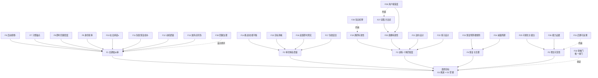

# 影响因素网：从最终目标的反向推导

> **状态：草稿·待审核**——本文是 synthesis 层（流水线第⑥步）的初稿，经用户审核前不作为运行时依据。
> **修订记录**：2026-09-29 随「不设事前伦理红线、审核门为唯一闸门」标准切换——原 F32 合规边界节点改为审核门；§5 由「消极因素红线总表」改为「风险因素表（审核参考）」。
> **推导目标**：让缺乏主观能动性的用户**痴迷于训练**并**掌握技能**。
> **方法**：从最终目标逐层反向分解，每层回答「上层因素的实现依赖什么」；节点标注影响方向与著作来源（book-id 对应 `works/` 目录）。

## 0. 最终目标的精确化

**最终目标 = G1 痴迷 × G2 掌握**

- **G1 痴迷**：长期、**自愿**的依从（北极星：第 8 周还在练，且是自愿的，而非被机制锁住）；
- **G2 掌握**：可验证、可迁移的技能/能力增长。

关键判断：G1 与 G2 互为因果，但也可以互相牺牲——
- 为留人而降低挑战 → 空心心流，G2 落空（R4 指标替代回路）；
- 只顾科学性而忽视动机设计 → 科学但没人练，G1 落空（R2 挫败螺旋）。

**系统的设计空间 = 两者乘积最大化**；机制取舍由用户在审核门逐案决定（F32），系统不做事前排除。

目标用户画像（框架的隐含设定）：启动困难、维持困难、有历史放弃记录、自报动机偏弱。因此设计重心压在**降低启动成本、制造即时回报、结构化恢复**，而非「激励一个已经很有能动性的人」。

## 1. L1 直接决定因素

| 节点 | 名称 | 影响 | 主要来源 |
| --- | --- | --- | --- |
| F1 | 长期依从率 | →G1 | atomic-habits, the-power-of-habit, grit（降级参考） |
| F2 | 单次训练体验质量 | →G1 →G2 | flow, game-feel |
| F3 | 训练-个体匹配度 | →G1 →G2 | peak, how-people-learn-2 |
| F4 | 恢复与生理状态 | →G1（防倦怠）→G2（超量补偿） | why-we-sleep, spark |
| F5 | 技能增长可见性 | →G1 →G2 | atomic-habits, flow, drive（专精） |

## 2. L2 中层因素

### 2.1 依从链（F1 的分解）

| 节点 | 名称 | 方向 | 来源 |
| --- | --- | --- | --- |
| F6 | 环境与启动摩擦 | 负向（越小越好） | atomic-habits, nudge, design-of-everyday-things |
| F7 | 习惯锚点稳固度 | + | atomic-habits, the-power-of-habit |
| F8 | 即时记录与回报密度 | +（有过理由效应边界，见 R3） | atomic-habits, flow, misbehaving（防新鲜感误判） |
| F9 | 身份叙事强度 | +（叙事工具，非核心机制） | atomic-habits（降级标注）, meditations, chuanxilu |
| F10 | 社会承诺与问责 | ±（效果与压力并存，设计取舍） | influence, social-psychology |
| F11 | 失败恢复成本 | 负向 | atomic-habits, mindset（降级参考） |
| F12 | 动机质量（自主/胜任/关系） | + | self-determination-theory, drive, intrinsic-motivation-1985 |
| F13 | 历史放弃点风险 | 负向 | 画像 d_consistency_history |

### 2.2 体验链（F2 的分解）

| 节点 | 名称 | 方向 | 来源 |
| --- | --- | --- | --- |
| F14 | 挑战-技能平衡 | + | flow, peak |
| F15 | 目标清晰度 | + | flow |
| F16 | 反馈通道即时性与真实性 | + | flow, game-feel, design-of-everyday-things |
| F17 | 失败可承受性（失败安全） | + | rules-of-play, game-feel |
| F18 | 感官反馈校准（多通道冗余与唤起结构） | + | game-sound, auditory-display, understanding-comics, the-art-of-game-design |

### 2.3 匹配链（F3 的分解）——G1 与 G2 之间的桥

| 节点 | 名称 | 方向 | 来源 |
| --- | --- | --- | --- |
| F19 | 领域调研有效性 | + | peak, make-it-stick |
| F20 | 用户模型有效性 | + | how-people-learn-2（先验）, misbehaving（个体差异） |
| F21 | 逆向设计执行度（能力证据→评估→活动） | + | understanding-by-design |
| F22 | 练习设计质量（间隔/渐进/难度序列） | + | make-it-stick, peak |

**链条表述**：用户匹配度 ← 调研有效性 × 用户模型有效性 × 匹配逻辑；其中**「交流用户接受度」（F28）反向约束前两者**——采集越贪多、调研越炫技，用户越不信任，画像越失真。这是网状结构而非纯链式的原因。

### 2.4 恢复链（F4 的分解）

| 节点 | 名称 | 方向 | 来源 |
| --- | --- | --- | --- |
| F23 | 恢复预算执行 | +（硬规则） | why-we-sleep, spark |
| F24 | 周期与减量安排 | + | peak, thinking-in-systems（延迟视角） |

### 2.5 可见性链（F5 的分解）

| 节点 | 名称 | 方向 | 来源 |
| --- | --- | --- | --- |
| F25 | 进度可视化与信息留白 | + | understanding-comics, atomic-habits |
| F26 | 能力证据沉淀（期末「能做到什么」） | + | understanding-by-design, chuanxilu（知行合一） |

## 3. L3 基础层（系统能力，约束全部分支）

| 节点 | 名称 | 来源 |
| --- | --- | --- |
| F27 | 采集方法论质量：最小提问、三角验证、揣情式访谈、反锚定 | guiguzi（揣情）, how-to-win-friends（倾听）, flow（测量批评）, thinking-fast-and-slow（反锚定） |
| F28 | 用户接受度与信任 | nudge（透明/可避免——书内主张）, designing-interactions（价值三问） |
| F29 | 知识纪律：逐主张验证、证据争议不入库、影响力≠有效性 | humanity 流水线, the-crowd（反面教材） |
| F30 | 系统回路治理：反指标、停止条件、延迟副作用 | thinking-in-systems, this-is-service-design-doing, misbehaving |
| F31 | 意义与后果可追溯（反装饰性代理） | hamlet-on-the-holodeck |
| F32 | **审核门：用户对一切提取与机制的逐案审定（唯一闸门）** | rules-of-play（自愿参与）+ 用户主权（2026-09-29 确认） |

## 4. 网状交叉：六条关键回路

回路是**实证机制**（著作可溯源），不是规范禁令；其「设计抓手」是可选的干预点，用与不用由审核门决定。

| 回路 | 类型 | 机制 | 设计抓手 |
| --- | --- | --- | --- |
| **R1 心流飞轮** | 增强，放大 | F14 校准 → F2 体验 → F1 依从 → 练习量 → F22/F26 技能与证据 → F5 可见性 → F12 胜任 → F1 ↑ | 设计目标：让飞轮转起来 |
| **R2 挫败螺旋** | 增强 | 挑战过高 → 失败 → 挫败 → 回避 → F1 崩塌 | F14 校准、F17 失败安全、F11 失败恢复 |
| **R3 奖励侵蚀回路** | 增强 | 外部奖励过密 → F12 内在动机被替代 → 奖励撤除后依从崩塌 | F8 密度权衡、奖励形态选择（P-MOT-3，待审核的设计建议） |
| **R4 指标替代回路** | 增强 | 打卡/streak 变成目标本身 → 空心依从 → G2 落空 → 信任受损 → 流失 | F21 逆向设计、F26 能力证据、P-GOV-1 三栏结算 |
| **R5 恢复透支回路** | 增强 | 加量 → 睡眠/压力破防 → 表现下降 → 挫败或伤病 → 退出 | F23 恢复预算（代码强制——用户已批准的硬规则）、F24 减量 |
| **R6 新鲜感误判回路** | 治理 | 新机制上线 → 短期提升 → 归因错误 → 扩大 → 退潮后崩塌 | 偏差类干预 4-6 周随访复验 P-GOV-2 |

> 注：R5 的恢复预算是当前**唯一**代码级硬规则（`recovery_budget`，用户批准）；其余回路抓手均为候选设计，待审核。

## 5. 风险因素表（审核参考，非事前禁令）

下表是各回路的已知风险信息，**供用户在审核门权衡**；任何一项都不构成事前排除。

| 风险因素 | 所属回路 | 证据来源 | 审核考量 |
| --- | --- | --- | --- |
| 诱导沉迷 / 移除退出 | 全局 | rules-of-play（自愿参与是游戏定义核心）、the-art-of-game-design（疲劳曲线） | 与 G1「长期自愿依从」直接冲突，建议重点权衡 |
| 虚假稀缺 / 伪造紧急 / 反馈与状态不符 | R1 滥用面 | design-of-everyday-things（反馈真实性）、game-sound、nudge | 虚假信息被识破后信任受损（石化林实验，works/influence） |
| 奖励侵蚀内在动机 | R3 | self-determination-theory（过度理由效应）、drive、intrinsic-motivation-1985 | 奖励形态（预期/有条件/实物）决定风险大小 |
| 指标替代（打卡 ≠ 掌握） | R4 | understanding-by-design、thinking-in-systems（Goodhart/Campbell 定律） | 能力证据是否独立于行为计数存在 |
| 把失败归因用户（意志/品质） | R2 | meditations（可控性归属）、grit（Credé 2017：特质预测增量有限） | 归因错误与证据不符且伤害 F11 |
| 指挥官式采集（问得多、信任少） | 匹配链 | guiguzi（揣情以少胜多）、flow（测量批评）、thinking-fast-and-slow（反锚定） | F28 信任是画像质量的前置 |
| 知识污染（证据不足的主张进入设计） | 全局 | humanity 流水线（证据纪律）、the-crowd（影响力≠有效性） | 证据性排除维持：验证判「存疑/被推翻」的不进提取 |
| 新鲜感误判扩大 | R6 | misbehaving（偏差是情境产物） | 随访复验机制 P-GOV-2 |
| 恢复透支 | R5 | why-we-sleep、spark | 恢复预算硬规则（用户已批准） |
| 特质羞辱 | R2 | grit（特质归因证据不足）、mindset（干预效应量小） | 与证据不符的设计模式 |

## 6. 网的主干简图

